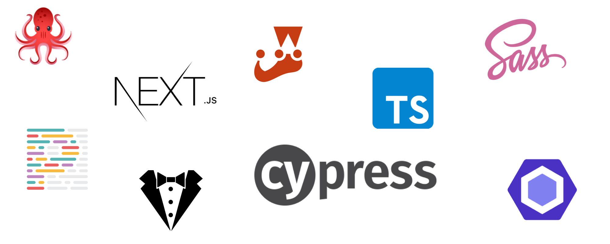

# Next.js Boilerplate
Feel free to use this Boilerplate as a starting point for your own Next.js Projects.

## 👶 Getting Started
Here you will find all the available npm commands.

### 👨‍💻 Develop
Use this command to develop local.

```
npm run dev
```

### 🏗 Build
This will create an optimized production build.

```
npm run build
```

### 🏃Run
Use this command to run your Application on the Server.

```
npm run start
```

### 🔎 Well structured code
You can run one of the following commands to lint your code.

```
npm run lint // JS & CSS
npm run lint:scss
npm run lint:js
```

### 🪲 Test
Run this command to execute your jest tests.

```
npm run test:unit
npm run test:unit:update // Update Snapshots
```

Run one of these commands to run your integration & e2e tests.

```
npm run cypress // Command Line
npm run cypress:open // GUI
```

### 🥷 Typescript
To verify your static typing run the following command.

```
npm run type:check
```

## 🧱 Tech Stack


